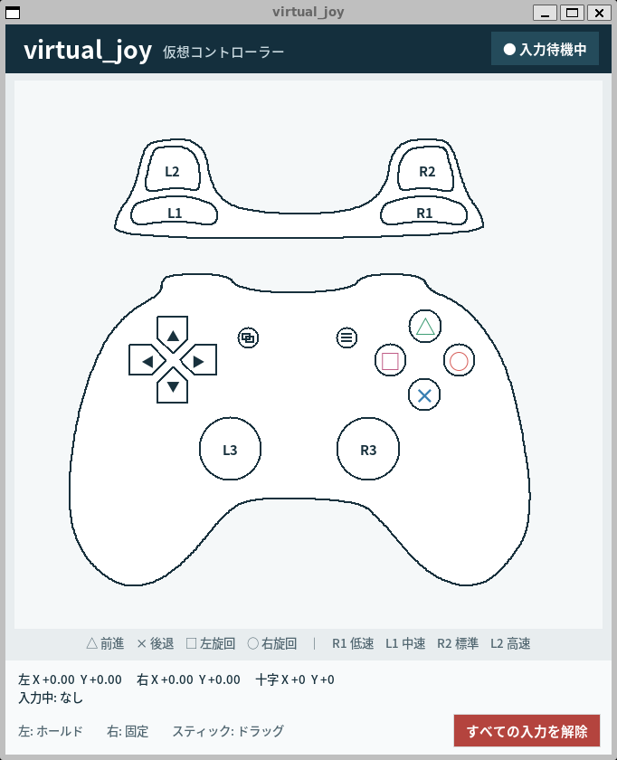
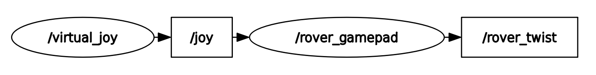

# virtual_joy

`virtual_joy` は、マウス操作で `sensor_msgs/msg/Joy` を生成する ROS 2 (`ament_python`) パッケージです。  
`virtual_joy` パッケージ単体で完結し、外部の rover gamepad パッケージに依存することなく使用できます。



コントローラーの筐体、ボタン輪郭、状態色、クリック判定は、専用の
CanvasベクターUIから生成します。輪郭画像と入力領域を別々に管理しないため、
表示と操作判定のずれを防ぎます。

## 前提環境

- Ubuntu Linux - Jammy Jellyfish (22.04)
- ROS 2 Humble Hawksbill
- `python3-tk`

`python3-tk` が未導入の場合:

```bash
sudo apt update
sudo apt install -y python3-tk
```

## 導入

```bash
mkdir -p ~/ros2_ws/src
cd ~/ros2_ws/src
git clone https://github.com/YOSHIDA-V/virtual_joy.git virtual_joy
```

## ビルド

```bash
cd ~/ros2_ws
source /opt/ros/humble/setup.bash
colcon build --symlink-install --packages-select virtual_joy
source install/setup.bash
```

## 実行方法

### 1) Joy配信のみ

- `virtual_joy.launch.py`
- `virtual_joy_node` を起動し、`Joy` を配信

```bash
ros2 launch virtual_joy virtual_joy.launch.py
```

### 2) Joy + rover制御用Twist配信

- `virtual_joy_rover.launch.py`
- `virtual_joy_node` と `rover_gamepad_node` を起動
- `Joy` を `Twist` (`/rover_twist`) に変換して配信

```bash
ros2 launch virtual_joy virtual_joy_rover.launch.py
```

起動すると、rqt_graph の様子は以下のようになります。



## Launch引数

`virtual_joy.launch.py`:

- `topic_name` (default: `joy`)
- `publish_rate_hz` (default: `20.0`)

`virtual_joy_rover.launch.py`:

- `topic_name` (default: `joy`)
- `joy_publish_rate_hz` (default: `20.0`)
- `cmd_publish_rate` (default: `100.0`)

例:

```bash
ros2 launch virtual_joy virtual_joy_rover.launch.py topic_name:=joy cmd_publish_rate:=50.0
```

## 動作確認

Joy確認:

```bash
ros2 topic echo /joy
```

Twist確認 (`virtual_joy_rover.launch.py` 実行時):

```bash
ros2 topic echo /rover_twist
```

## コントローラーボタン割り当て

⚫ ABXY(△×〇□)ボタン  
上図に記載の速度でローバーが走行します。十字ボタンと同時押しすると、押されているボタンの速度が合成されます。

⚫ 十字ボタン  
上図に記載の速度でローバーが走行します。ABXY ボタンと同時押しすると、押されているボタンの速度が合成されます。

⚫ L / LT / R / RT (L1/L2/R1/R2)ボタン  
アナログスティックの入力に対するセーフティー機能および最大並進移動速度と最大旋回速度の選択ボタンとして機能します。いずれかのボタンを押している間のみ、アナログスティックの入力が有効になります。LT(L2)は、ユーザーが定義した最大並進移動速度および最大旋回速度の設定が反映されます。

⚫ 左右アナログスティック  
上下方向が前後への並進移動速度、左右方向が旋回速度の指令値となります。大きく倒すほど速く走行します。L,LT,R,RT(L1,L2,R1,R2)のいずれかを押下している間のみ有効になります。

## 移動パラメータ（`virtual_joy_rover.launch.py`）

`rover_gamepad_node` で使用している主な速度パラメータは以下です。

- △ / × ボタン（前後速度加算）: `±0.1 m/s`
- □ / 〇 ボタン（旋回速度加算）: `±0.3 rad/s`
- 十字ボタン 上下（前後）: `±0.3 m/s`
- 十字ボタン 左右（横移動）: `±0.3 m/s`

### スティック有効化と速度モード（L1/L2/R1/R2）

- L1/L2/R1/R2 のいずれかを押している間のみ、スティック入力が有効
- 速度係数:
  - `R1`: 並進 `0.5` / 旋回 `1.04`
  - `L1`: 並進 `0.8` / 旋回 `1.57`
  - `R2`: 並進 `1.0` / 旋回 `2.10`
  - `L2`: 並進 `1.5` / 旋回 `2.50`

補足:

- `cmd_publish_rate` は `/rover_twist` の publish 周波数（Hz）です。
