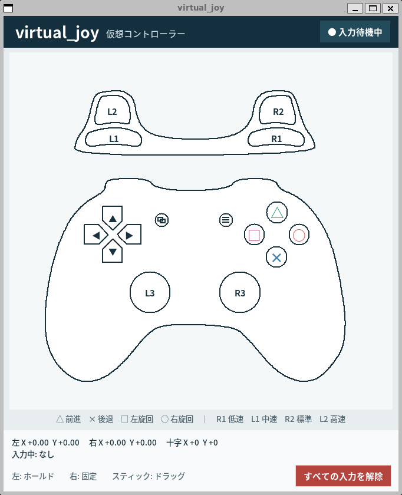

# virtual_joy (ROS 2 Jazzy)

`virtual_joy` は、マウス操作で `sensor_msgs/msg/Joy` を生成する ROS 2 (`ament_python`) パッケージです。  
`virtual_joy` パッケージ単体で完結し、外部の rover gamepad パッケージに依存することなく使用できます。

この`jazzy`ブランチはUbuntu 24.04 / ROS 2 Jazzy用です。
Humble向けの既存プログラムは[mainブランチ](https://github.com/YOSHIDA-V/virtual_joy/tree/main)にあります。



コントローラーの筐体、ボタン輪郭、状態色、クリック判定は、専用の
CanvasベクターUIから生成します。輪郭画像と入力領域を別々に管理しないため、
表示と操作判定のずれを防ぎます。

## 前提環境

- Ubuntu Linux - Noble Numbat (24.04)
- ROS 2 Jazzy
- `python3-tk`
- 動作確認したRMW: `rmw_cyclonedds_cpp` (CycloneDDS)

ROS 2 Jazzyを導入した環境で、以下の依存・開発ツールをインストールします。

```bash
sudo apt update
sudo apt install -y python3-tk python3-rosdep \
  python3-colcon-common-extensions ros-jazzy-rmw-cyclonedds-cpp
```

## 導入

```bash
mkdir -p ~/ros2_ws/src
cd ~/ros2_ws/src
git clone --branch jazzy --single-branch https://github.com/YOSHIDA-V/virtual_joy.git virtual_joy
```

## ビルド

```bash
cd ~/ros2_ws
source /opt/ros/jazzy/setup.bash
rosdep install --from-paths src/virtual_joy --ignore-src --rosdistro jazzy -y
colcon build --symlink-install --packages-select virtual_joy
source install/setup.bash
```

rosdep未初期化の環境では、先に`sudo rosdep init`と`rosdep update`を実行してください。

## 実行方法

実行・トピック確認に使う各ターミナルで、環境を設定します。
以下はドメイン100・CycloneDDSの構成です。

```bash
source /opt/ros/jazzy/setup.bash
source ~/ros2_ws/install/setup.bash
export ROS_DOMAIN_ID=100
export RMW_IMPLEMENTATION=rmw_cyclonedds_cpp
```

### 1) Joy配信のみ

- `virtual_joy.launch.py`
- `virtual_joy_node` を起動し、`Joy` を配信

```bash
ros2 launch virtual_joy virtual_joy.launch.py
```

### 2) Joy + rover制御用Twist配信

- `virtual_joy_rover.launch.py`
- `virtual_joy_node` と `rover_gamepad_node` を起動
- `Joy` を `Twist` (`/rover_twist`) に変換して配信

```bash
ros2 launch virtual_joy virtual_joy_rover.launch.py
```

起動すると、rqt_graph の様子は以下のようになります。


## Launch引数

`virtual_joy.launch.py`:

- `topic_name` (default: `joy`)
- `publish_rate_hz` (default: `20.0`)

`virtual_joy_rover.launch.py`:

- `topic_name` (default: `joy`)
- `joy_publish_rate_hz` (default: `20.0`)
- `cmd_publish_rate` (default: `100.0`)

例:

```bash
ros2 launch virtual_joy virtual_joy_rover.launch.py topic_name:=joy cmd_publish_rate:=50.0
```

## 動作確認

Jazzyでの導入・検証結果と制約は[検証記録](evidence/jazzy/REPORT.md)を参照してください。
WSLの仮想ディスプレイでの表示・ROS通信を確認しています。
ユーザー画面での手動操作・実機走行は未確認です。

Joy確認:

```bash
ros2 topic echo /joy
```

Twist確認 (`virtual_joy_rover.launch.py` 実行時):

```bash
ros2 topic echo /rover_twist
```

## コントローラーボタン割り当て

⚫ ABXY(△×〇□)ボタン  
上図に記載の速度でローバーが走行します。十字ボタンと同時押しすると、押されているボタンの速度が合成されます。

⚫ 十字ボタン  
上図に記載の速度でローバーが走行します。ABXY ボタンと同時押しすると、押されているボタンの速度が合成されます。

⚫ L / LT / R / RT (L1/L2/R1/R2)ボタン  
アナログスティックの入力に対するセーフティー機能および最大並進移動速度と最大旋回速度の選択ボタンとして機能します。いずれかのボタンを押している間のみ、アナログスティックの入力が有効になります。LT(L2)は、ユーザーが定義した最大並進移動速度および最大旋回速度の設定が反映されます。

⚫ 左右アナログスティック  
上下方向が前後への並進移動速度、左右方向が旋回速度の指令値となります。大きく倒すほど速く走行します。L,LT,R,RT(L1,L2,R1,R2)のいずれかを押下している間のみ有効になります。

## 移動パラメータ（`virtual_joy_rover.launch.py`）

`rover_gamepad_node` で使用している主な速度パラメータは以下です。

- △ / × ボタン（前後速度加算）: `±0.1 m/s`
- □ / 〇 ボタン（旋回速度加算）: `±0.3 rad/s`
- 十字ボタン 上下（前後）: `±0.3 m/s`
- 十字ボタン 左右（横移動）: `±0.3 m/s`

### スティック有効化と速度モード（L1/L2/R1/R2）

- L1/L2/R1/R2 のいずれかを押している間のみ、スティック入力が有効
- 速度係数:
  - `R1`: 並進 `0.5` / 旋回 `1.04`
  - `L1`: 並進 `0.8` / 旋回 `1.57`
  - `R2`: 並進 `1.0` / 旋回 `2.10`
  - `L2`: 並進 `1.5` / 旋回 `2.50`

補足:

- `cmd_publish_rate` は `/rover_twist` の publish 周波数（Hz）です。
- Joyを1.0秒より長く受信しないと、`linear.x`、`linear.y`、`angular.z`を0にします。
- ウィンドウの閉じる操作とCtrl+Cで、GUIとROSノードの終了処理を行います。

## 開発用の再検証

既存のUI geometryテスト:

```bash
cd ~/ros2_ws/src/virtual_joy
python3 -m unittest discover -s test -p test_controller_ui.py -v
```

ROS通信・入力変換・timeout・SIGINT終了の検証には、追加で`xvfb`と`python3-pil`を使用します。
cleanなソースと同じソースからビルドしたoverlayを使用してください。

```bash
sudo apt install -y xvfb python3-pil
source /opt/ros/jazzy/setup.bash
source ~/ros2_ws/install/setup.bash
cd ~/ros2_ws/src/virtual_joy
export ROS_DOMAIN_ID=100
export RMW_IMPLEMENTATION=rmw_cyclonedds_cpp
export ROS_AUTOMATIC_DISCOVERY_RANGE=LOCALHOST
xvfb-run -a python3 -m unittest discover -s test -v
run_dir=$(mktemp -d /tmp/virtual-joy-jazzy.XXXXXX)
xvfb-run -a --server-args='-screen 0 1280x960x24 -nolisten tcp' \
  python3 tools/verify_jazzy_runtime.py --expected-commit "$(git rev-parse HEAD)" \
  --run-dir "$run_dir" --require-clean-shutdown --require-lateral-stop \
  > "$run_dir/runtime.log" 2>&1
```

この検証は専用名前空間`/virtual_joy_jazzy_check`と仮想ディスプレイを使用し、
アプリケーションの状態APIで入力値を設定します。マウス・キーボード入力は合成しません。
メッセージ、PID、runtime hash、結果、画面画像は`run_dir`に保存します。
